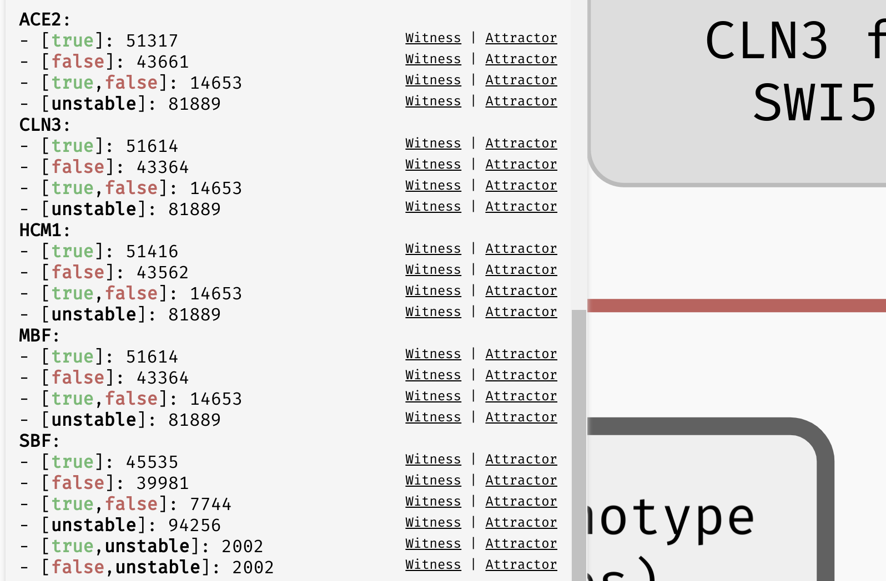

# Stability analysis

In many real world situations, what we are truly interested in is not only the type of attractor (stability, oscillation, disorder), but also the values of some significant variables in that attractor. In particular, in an attractor, a variable can be *stable* (always `true`, or always `false`) or unstable (changing its value depending on the attractor state). Recall that in the section about state space visualisation, we saw a disordered attractor with three unstable variables (`v_1`, `v_2`, and `v_4`), and one stable variable (`v_3`). In the presence of multiple attractors, we also say that a variable may exhibit *switched* behaviour if there are multiple attractors such that the stability properties of the variable change from attractor to attractor.

All these properties can change with respect to parameters, but don't alter the attractor type. To analyse these types of situations, AEON contains a `Stability Analysis` functionality which can further divide the parameter space based on the stability of individual variables.

You can run stability analysis for any node of the bifurcation decision tree (even mixed or decision nodes). This way, you can quickly assess how the stability of variables changes in your tree. Furthermore, you can also restrict the analysis based on the attractor type to only show how the variables change in these particular attractors. Finally, for each case, you can generate a `Witness` network as well as visualise the `Attractor` state space. 

*Stability analysis result for the `Orlando` example model. `[true]`/`[false]`/`[unstable]` represent situations where the variable always exhibits one type of behaviour, while multiple values (e.g. `[true,false]` or `[true,unstable]`) represent a switching behaviour.*