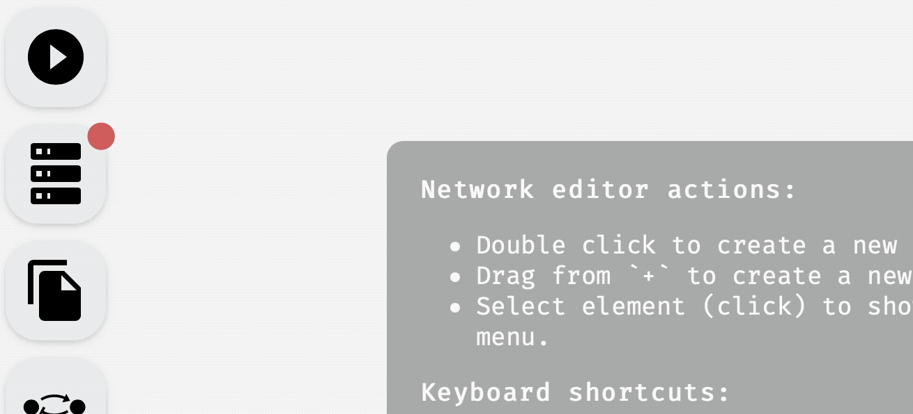

# AEON Compute Engine

To download the compute engine for the version of AEON you are using, pick `Compute Engine` in the left menu, and download a pre-compiled binary for your operating system. Compute engine binaries for different versions of AEON are in general not compatible, and you should be therefore always using the compute engine of your current version: 


*Downloading AEON compute engine.*

Once the download is finished, you can unzip the file. Inside, you should find a `compute-engine` binary that you need to execute.

> The binary is not signed for distribution on MacOS, so you may need to add a security exception if you want to run it on a Mac.

When you execute the binary, you should see a terminal window with an output similar to this:

```
🔧 Configured for production.
    => address: localhost
    => port: 8000
    => log: critical
    => workers: 8
    => secret key: generated
    => limits: forms = 32KiB
    => keep-alive: 5s
    => read timeout: 5s
    => write timeout: 5s
    => tls: disabled
Warning: environment is 'production', but no `secret_key` is configured
🚀 Rocket has launched from http://localhost:8000
```

The compute engine automatically starts a local webserver on port `8000` through which it communicates with the AEON website. You can set the environmental variable `AEON_PORT` to whatever you need the port to be.

> If you can't for any reason run the binary (for example, some Linux systems seem to have problems with outdated `glibc`), you can build it from source. Instructions for this are quite simple, and you can find them in the *Building AEON* chapter.

Once compute engine is running, you can go back to the AEON website and either (a) refresh the website, if running correctly, the compute engine should connect automatically, or (b) press `Connect` in the `Compute Engine` panel to manually retry the connection. You should see the status change from *disconnected* to *connected*, and the dot next to the `Compute Engine` should change its color to green.


*Connecting to a running compute engine.*

> If you changed the `AEON_PORT` value, you need to also update the engine address in the `Compute Engine` panel — click the default address `http://localhost:8000` to edit it.

**WARNING:** At the moment, the compute engine supports only one active session of AEON at a time (this will be resolved in future versions of AEON). If you have multiple tabs with AEON open, and they all connect to the same compute engine, they can see and override each other's data! You can still use multiple tabs to edit or view networks, but keep in mind that analysis results (attractors and bifurcation decision trees) are available only for the last computed tab. 

Now, you should be ready to use all features available in AEON.