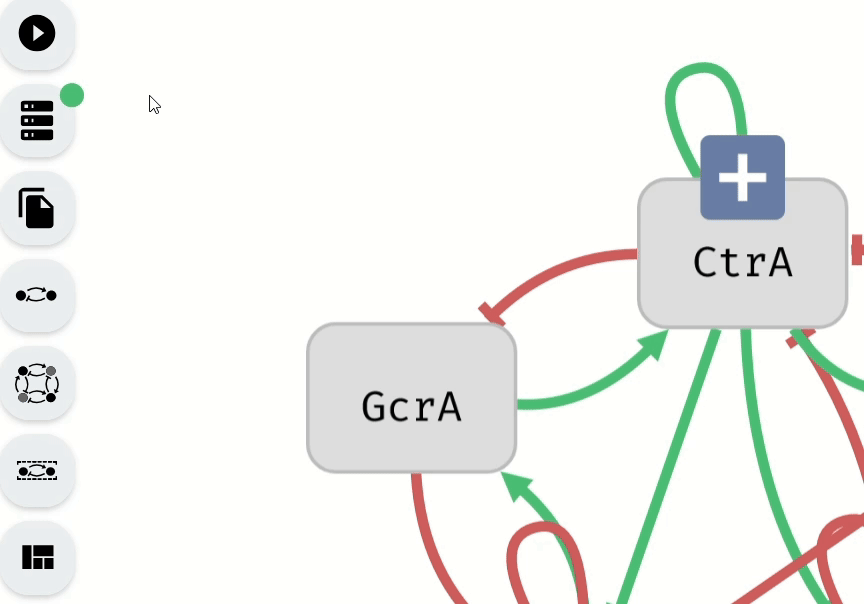

# Limiting the Control Computation

Aeon provides options for restricting the control computation, allowing users to filter out redundant results and, in some cases, improve performance. These options can be found under the Control Computation Mode in the Start Computation module, accessible by clicking the corresponding button in the left panel.

*Navigation to the options for limiting the control computation*

The available limiting parameters include:

- Min Robustness (%) – The minimum percentage of Boolean network interpretations for which a computed perturbation must be effective. This is a real number with two decimal places, ranging from 0 to 100.
- Max Size – The maximum number of variables allowed in a perturbation. This is a whole number starting from 0. By default, it is set to the number of controllable variables in the model.
- Max Number of Results – The maximum number of perturbations to compute. This is a whole number starting from 0. The default value is set to 1,000,000.