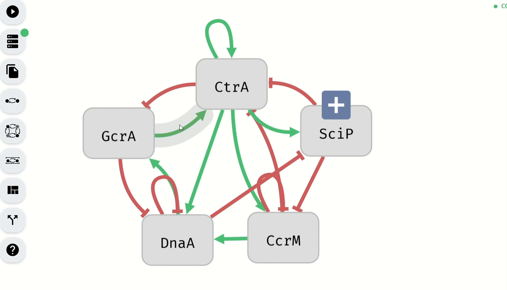
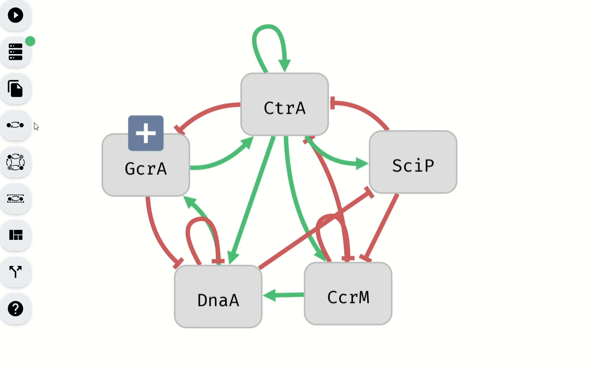

# Setting Control Parameters with the Model Editor

In Aeon, control parameters can be modified not only through dedicated editors but also directly within the Model Editor. This functionality allows for quick adjustments to the controllability and phenotype status of variables without switching to separate menus.

Each row in the Model Editor’s variable table includes two buttons, each corresponding to a specific control parameter:

- Controllability Button – Toggles whether the variable is controllable.
- Phenotype Button – Adjusts the phenotype status of the variable.

## Controllability Button

The Controllability Button is represented by a controller icon and is used to toggle the controllability status of a variable. Clicking on this button changes whether the variable can be included in perturbations. The button also visually indicates the variable's controllability status through its color:

- Yellow – The variable is controllable.
- Grey – The variable is not controllable.

*Making controllable variables uncontrollable using the Model Editor*

## Phenotype Button

The Phenotype Button is represented by a target icon and is used to modify the phenotype status of a variable. Clicking on this button toggles whether the variable is included in the phenotype and, if so, whether it is set to true or false. The button's color visually indicates the variable’s phenotype status:

- Green – The variable is included in the phenotype as true.
- Red – The variable is included in the phenotype as false.
- Gray – The variable is not included in the phenotype.

*Setting of the phenotype using the Model Editor*