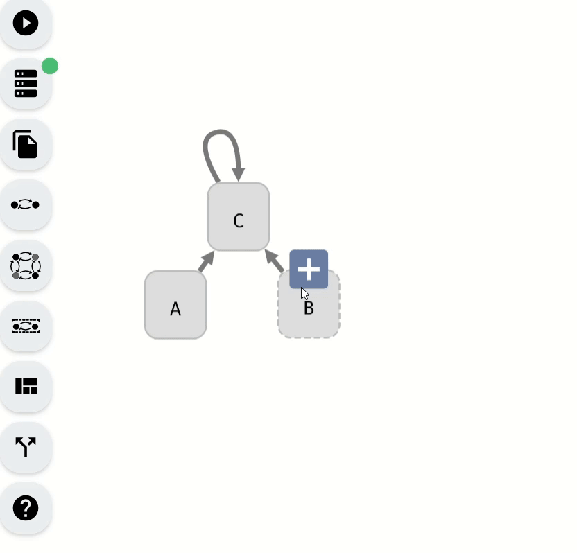
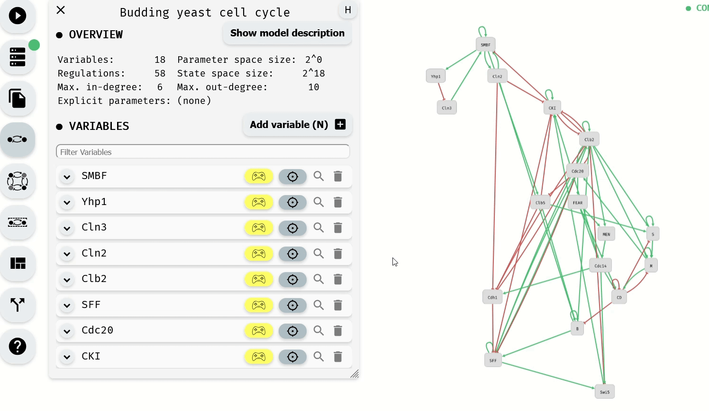
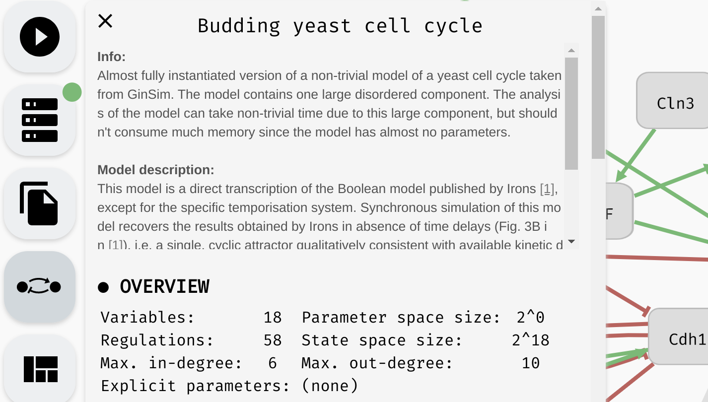

# Model panel and update functions

Once the regulatory graph of your Boolean network is in place, you can assign each variable an update function. The update function of variable `A` takes the values of its regulators (sources of the regulation edges terminating in `A`) and computes a new value of `A` based on these values.

For example, consider the following regulatory graph:

Here, variable `C` is regulated by every variable. That is, update function of `C` should depend on `A`, `B`, and `C`. For example, we can open the model panel and set the update function to `C | (!A & !B)`. This will make `C` `true` if it already is `true`, or if both `A` and `B` are false.

*Setting the update function of `C`.*

The behaviour of the Boolean network is described using a state transition graph, where the graph vertices are the *states* of the network (each state assigns `true` or `false` to every network variable), and the edges correspond to applications of individual update functions to the network states. In our network, a state `A=false, B=false, C=false` can transition into `A=false, B=false, C=true` by updating the variable `C`.

Note that `A` and `B` have no regulations, therefore their update functions do not depend on any variable and must be constant: `true` or `false`. In general, an update function can use the constant values `true/false`, names of the regulating variables, parenthesis `()`, and (`&`), or (`|`), implies (`=>`), if and only if (`<=>`) as well as xor (`^`). You can add new-lines and arbitrary whitespace to the update function, but AEON will not save this information to the exported model file.

### Other model panel functionality

Aside from setting the update functions, in the model panel, you can create/remove variables as well as edit their names (as we have already seen). In a large model, it can be also useful to *locate* a specific variable in the regulatory graph using the magnifying glass button. 

*Looking up and editing a variable in a model panel.*

> Hint: When the model is very large, you can use the "Find..." feature of your browser to look for specific variables in the model panel.

Finally, at the very top of the model panel, you can find an edit field where you specify the *name* of your model, as well as some general *description* of the model. This part of the panel also contains a general overview of the model, including:

 - Number of Boolean variables and regulations between them.
 - Maximal in-degree and out-degree (number of incoming and outgoing regulations) in the model.
 - Size of the models state space.
 - Size of the parameter space, as well as names of the logical parameters.

*The name, description, and overview of a particular model.*