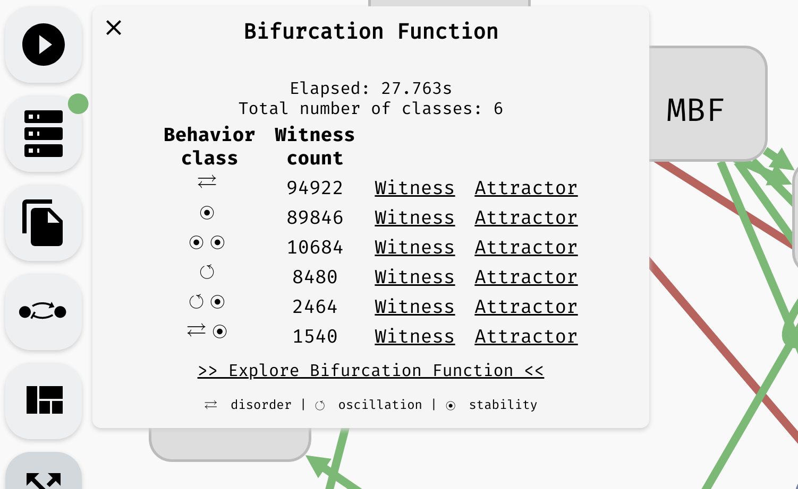

# Attractor Bifurcation

In this chapter, you will learn how to study the long term behaviour of Boolean networks using AEON. Specifically, we refer to this analysis as *attractor bifurcation*, because it examines how parameters influence the long term behaviour (attractors) of a particular Boolean network.

Attractors are subgraphs of the asynchronous state transition graph of the Boolean network. Recall that this graph consists of *states* which assign Boolean value to each variable of the network, and *transitions* which correspond to applications of individual update functions. Then, attractor consists of states that, once reached, cannot be escaped. Informally, these are the regions where the network eventually converges to, and stays forever. In terms of graph theory, these are the bottom (terminal) strongly connected components of the state transition graph. 

In AEON, we distinguish between three main types of attractors:
 
 - *Stable attractor* is an attractor which consists of a single state. This type of attractor is also called a *sink*.
 - *Oscillating attractor* is a cycle of states. The length of the cycle is its *period*, hence this type of attractor is sometimes also referred to as *periodic*.
 - *Disordered attractor* is an arbitrary set of states consisting of multiple connected cycles. This type of attractor is also called *aperiodic*.

*Three types of attractors. Notice that each type is labelled with an appropriate icon.*

To compute the attractors of the network, click `Start Analysis` in the left menu. Keep in mind that for large models (especially with a lot of parameters), this process can take a long time. The compute engine color should change to orange, and you should find a (very) approximate progress of the computation in the compute engine panel. Here, you can also cancel the current computation.

*Starting and cancelling a computation.*

> Due to the nature of the problem, it is typically not possible to accurately predict how long it will take to compute the results. The progress corresponds to the number of states eliminated as "non-attractor" states so far, however, this is only meaningful when the attractors are relatively small. Also, as discussed previously, AEON compute engine can only run one computation at a time. If you need to run multiple experiments simultaneously, we recommend running multiple compute engines.

Once the computation is finished, you should be taken to the `Results` panel, where you can see the overview of the *attractor bifurcation function*. If your model has no parameters, the function has one row showing the types of attractors in your network (behaviour class). In a parametrised model, there are usually multiple rows, each showing you the *number of parametrisations* (witness count) which produce a specific type of behaviour.

*An overview of an attractor bifurcation function of a parametrised Boolean network. There are 6 behaviour classes, two having an oscillating attractor and two having a disordered attractor. Remaining attractors are stable.*

> Note that the attractors that fall into the individual behaviour classes may not have identical state space. Only their type is equivalent. For example, a class with a single stable attractor can actually cover many distinct stable states. However, in every parametrisation (for that class), AEON guarantees there is exactly one stable state. You can then use stability analysis to examine how the values of variables differ in various conditions.  

From here, you can continue in different directions:
 
 - You can generate a `Witness` for each behaviour class. This is a fully specified Boolean network (no parameters) that exhibits the attractors as described by the behaviour class.
 - You can explore the state space of the discovered attractors by clicking `Attractors`.
 - You can explore the dependence between attractors and behaviour classes using a decision tree (`Explore Bifurcation Function`).
 - You can examine stable/unstable/switched variables in the attractors of a particular behaviour class (`Explore Bifurcation Function`).

We discuss these methods in the following sections.