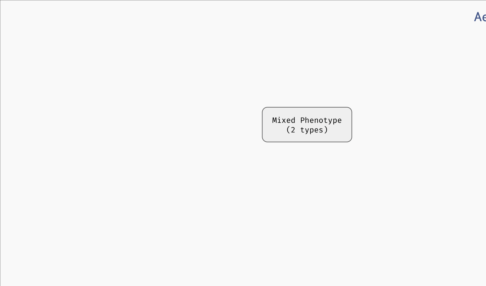

# Bifurcation decision trees

To follow along with this section, you can download the `.aeon` model we will be using [here](../assets/example_simple_tree.aeon). After loading it into AEON, you should see that the model has 66 variables and 13 parameters. Here, the parameters correspond to the *input* nodes of the regulatory graph, i.e. variables with no incoming regulations. Computing attractors for this model should take somewhere between 30 and 60 seconds. 

The model can exhibit two behaviour classes: One with a stable attractor, and one with a disordered attractor. However, it is not clear which conditions lead to these two different classes! To explore this further, open the `Bifurcation Function Explorer`.

In this window, we will be constructing a *bifurcation decision tree* which describes how parameters alter the behaviour of the network. This decision tree consists of three types of nodes:

 - A *leaf* node corresponds to a set of parametrisations which admit only a single behaviour class.
 - A *mixed* node corresponds to a set of parametrisations which admit multiple behaviour classes.   
 - A *decision* node splits the parametrisations based on a value of a specific parameter. 

Our goal will be to gradually turn *mixed* nodes into *leaf* or *decision* nodes to uncover which parameters influence the presence of different attractors in the network.

Initially, the tree contains a single mixed node with all admissible parametrisations of the network. By clicking the node, we reveal an overview similar to the `Results` panel in the main AEON window. However, we can also turn this mixed node into a decision node using the `Make Decision` button. This button will cause AEON to compute possible impact of picking different parameters as decision *attributes*. You will then be presented with a list of *attributes* (i.e. parameters) that you can use to split the mixed node into two. For each decision attribute, AEON shows you the impact of that decision on the behavior classes in the mixed node. If the decision isolates one behaviour class from the rest, a leaf node with that class will appear. Otherwise, a new mixed node is created.

*Creating decision nodes. Here, a parameter `sigA` is selected as the decision attribute, creating one leaf node with only disordered attractors, and one mixed node.*

AEON will automatically sort the attributes based on how likely it is that they lead to a concise decision tree. We use [information gain](https://en.wikipedia.org/wiki/Information_gain_in_decision_trees) as the primary sorting criterion. However, you can also pick from other sorting heuristics:

 - Total number of behaviour classes in both branches after making the decision. 
 - Number of parametrisations in the positive or negative branch. 
 - Number of parametrisations in the largest class (*majority*) of the positive/negative branch.
 - Alphabetical sort.

There is generally no "best" decision attribute. The attribute you select usually depends on what you are trying to achieve with your decision tree. On the one hand, if you already have experimental data that you are trying to reproduce, you may be restricted to a set of measured/controllable parameters. On the other hand, if you are trying to explain the presence of a particular behaviour class, you may want to minimise the number of decisions necessary to isolate said class. And so on.

In our case, AEON will suggest `glucose` as the next decision attribute, producing the following tree:

*A decision tree for the example model.*

As you can see, all mixed nodes are now gone. This is interesting, because as you may recall, the network has 13 parameters in total. However, only two of these parameters seem to actually play a role in the type of attractors appearing in the network (the remaining parameters can still determine what specific values the network variables take in the attractors -- we will explore this in the section about stability analysis). Furthermore, we can also clearly see that to bring the network into a stable state, it is sufficient to set `sigA=true` and `glucose=false`.

> If you want to, you can now delete the decision nodes (select a node and click a red `X` in its corner) and try a different combination of decision attributes. You should discover that for this particular model, the remaining parameters indeed play no role in determining the attractor types: you will eventually have to make decisions on `sigA` and `glucose` in either case.

You can also generate a `Witness` network and explore `Attractor` state space for each leaf node of the tree, just as you could in the overview table of the bifurcation function. Furthermore, you can ask AEON to automatically expand a mixed node up to a certain depth using the `Auto Expand` function (AEON will use information gain to select the decision attributes).

### Decision attributes of unknown Boolean functions

As you may have noticed, up to this point, the parameters of the network were always constants that can be either `true` or `false`, so it was simple to make decision nodes. If a network contains an uninterpreted function as a parameter (for example, recall the `C | f(A, B)` we used in the section about parametrised networks), it is not very clear how such a function can appear in a decision tree.

One option is to simply decide based on specific values in the function table. For example, `f(0,1)` could be a decision attribute that fixes the value of `f(0,1)` to be either `true` or `false`. However, it is often very hard to understand how a decision tree with such attributes translates to real life conditions. Specifically, if we want to test such condition in the real world, we would have to ensure that both inputs of the function are fixed to a specific value, which may not be always possible.

We thus also admit a different type of decision attributes for these parameters. We say that an input `X` is *essential* in function `f` if the value of `f` depends on the value of `X` (recall the observability property in regulatory graphs). We can then generalize this property further, and say that `X` is essential in `f` when `Y=true`. This means that not only `f` has to depend on the value of `X`, it has to depend on it when `Y=true`.

This kind of property should be easier to test and understand, because (a) we are only fixing a partial context (`Y=true`) for the function, instead of the entire input vector, and (b) we are clearly stating a variable (`X`) that is significant in determining the resulting value of the function in that context.   

*Example of a basic uninterpreted function constraint (implicitly parametrised function of variable `CcrM` is true for `CcrM=CtrA=SciP=false`), as well as an essentiality constraint (variable `CtrA` influences the outcome of the implicit function of `DnaA` when `CcrM=GcrA=false`).*

To see these attributes in action, you can explore the decision tree of the model which we will now use to discuss trees with reduced precision...

### Reduced precision trees

In some cases, the decision tree is not very concise and can be hard to read. For example, let's consider another version of the `G2A` model available [here](../assets/g2a.aeon). This model is highly parametrised (in a rather unrealistic way nonetheless), and as a result, its bifurcation decision tree is quite large. However, in a lot of its nodes, there is a distinctive *majority* behaviour class that appears significantly more often than other classes. 

In practice, we may want to allow a node with such a class to be regarded as a leaf, thus eliminating the remaining edge cases from the tree. In the bottom right corner of the AEON interface, you should see a `Precision` slider. By adjusting this slider, you specify what percentage of parametrisations needs to fall into a single class for a node to be accepted as a leaf. By default, this is set to the "exact" precision of 100%, however, you can reduce the number to collapse less likely branches of the tree into leaves: 

*Collapsing branches of a complex tree with more than 90% majority behaviour class into leaves.*

In a highly parametrised model, this is a great tool for focusing only on the most statistically significant types of behaviour.