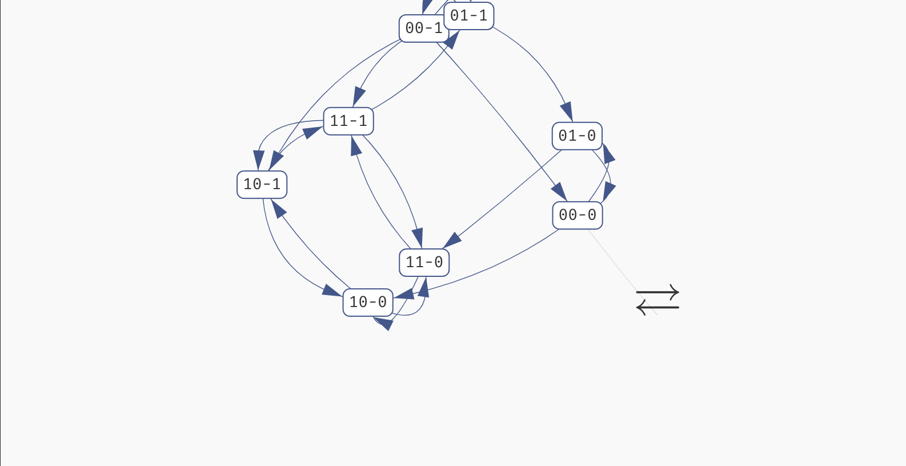
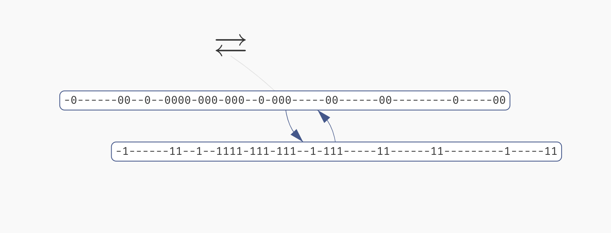

# State space explorer

If you click the `Attractors` button in the `Results` panel, a state space explorer appears with the exact representation of the attractors discovered in the network for that particular behaviour class.

You can click each state to see a breakdown of the variables which are true (green) or false (red) in said state. In an oscillating or disordered attractor, the state labels will contain a dash (`-`) in place of variables which have a fixed (stable) value in the whole attractor. They will be also shown as grey in the variable values list. This way, you can quickly visually distinguish which variables are fixed and which are being updated in the attractor.

However, if your network is parametrised, remember that this visualisation always shows attractors of a fully specified Boolean network that was picked from the particular behaviour class. That is, state space of attractors in other parametrisations can be different. To show the update functions used in this particular network, you can click the `Function` button in the top left. 

*Exploring the states of a disordered attractor.*

> Keep in mind that in a large network, you can use the `Find...` functionality of your browser to quickly highlight the important variables in the list of variable values. 

Finally, if the attractor is very large (approx. >5.000 states), we can't easily display it in a browser. We thus only show a simplified view of the attractor compressed into two states. In these two states, the stable variables have the values with which they appear in the attractor, and the unstable values simply all switch between `true` and `false` in one transition:

*A view of a large compressed attractor.*