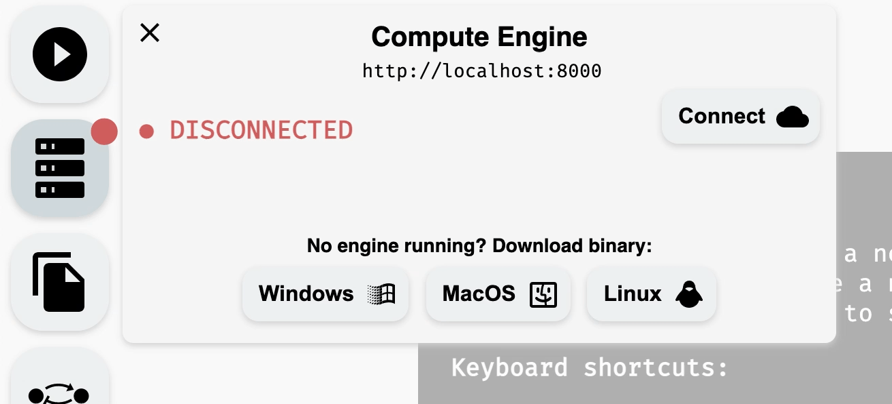
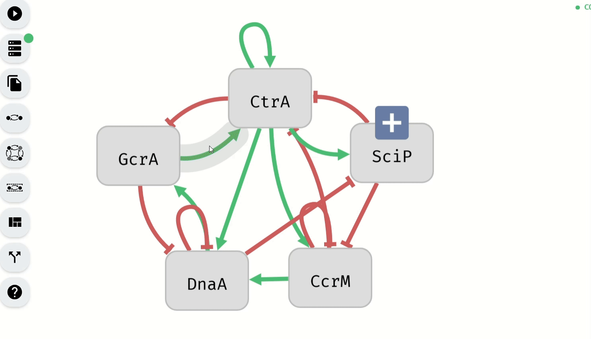
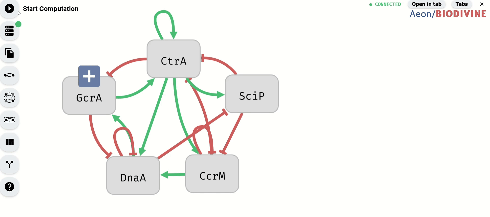
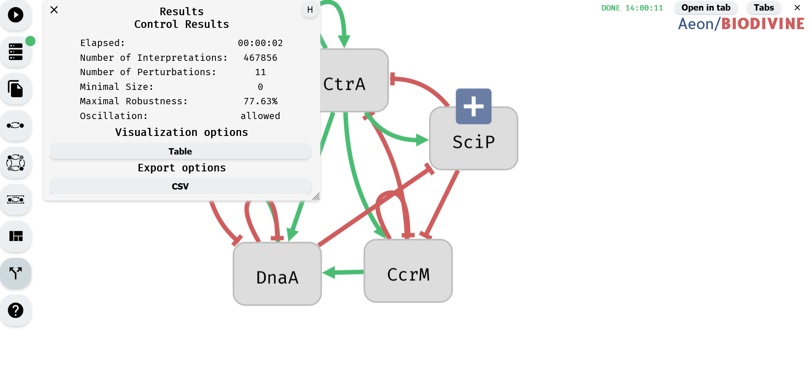

# Control Computation Demonstration

This section provides a step-by-step guide for running an example control computation in Aeon. It covers the setup process, parameter configuration, and execution of the computation.

### 1. Running Aeon

*State of the Aeon tool at startup*

Aeon can be accessed either through its online version ([URL]) or by downloading and running it locally ([URL]).

### 2. Connecting the Compute Engine

Open the Compute Engine module from the left panel to check the connection status. If the Compute Engine is not connected, download the appropriate version for the system from the bottom of the module and run it locally.

*Downloading AEON compute engine.*

*Connecting to a running compute engine.*

### 3. Importing or Creating a Model

A model can be created using the Model Editor or imported through the Import/Export module, both accessible from the left panel. The Import/Export module allows loading a model from local storage or selecting one of the default models available at the bottom of the module.

*Import of the G2A example model*

### 4. Setting Controllable Variables

The Controllable Editor module, accessible from the left panel, is used to define which variables are controllable and can be included in perturbations. By default, variables are set as controllable unless specified otherwise in the imported model.

To change the controllability status of multiple variables, select them and use the Controllability Buttons.

*Making controllable variables uncontrollable using the Controllable Editor*

Alternatively, controllability can be modified for individual variables using the Model Editor module.

*Making controllable variables uncontrollable using the Model Editor*

### 5. Defining the Phenotype

The Phenotype Editor module, located in the left panel, is used to specify the phenotype of the model by assigning Boolean values to selected variables. By default, variables are not part of the phenotype unless specified in the imported model.

- To add variables to the phenotype as true, select them and click the green button.
- To add variables to the phenotype as false, select them and click the red button.
- To remove variables from the phenotype, select them and click the gray button.

*Setting of the phenotype using the Phenotype Editor*

The Model Editor module can also be used to set phenotype values for individual variables.

*Setting of the phenotype using the Model Editor*

### 6. Configuring Computation Limits and Starting the Process

In the Start Computation module, accessible from the left panel, set the computation mode to Control. Under the Control Settings section, configure computation limits:

- Min Robustness (%) – Minimum percentage of Boolean network interpretations for which perturbations must work.
- Max Size – Maximum number of variables allowed in a perturbation.
- Max Number of Results – Maximum number of computed perturbations.

Once parameters are set, start the computation using the button at the bottom of the module.

*Setting computation limits and starting the computation*

### 7. Viewing Control Results

Once the computation is complete, the Results module opens automatically, displaying a summary of results. If needed, this module can also be accessed from the left panel.

*Control Results Module*

The results can be further explored using visualization options or exported for external use.