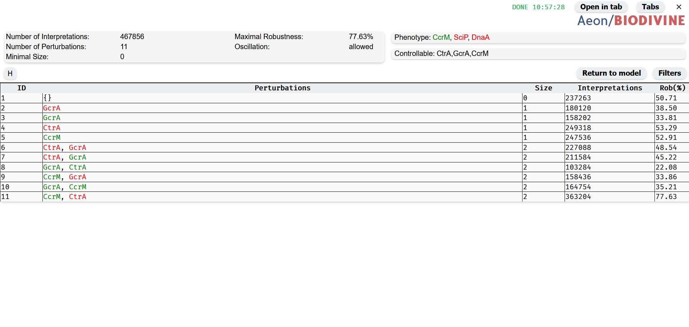
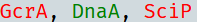
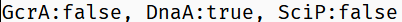
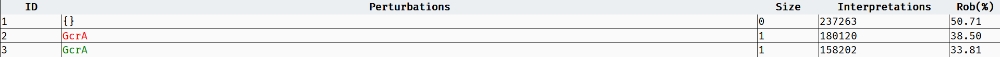
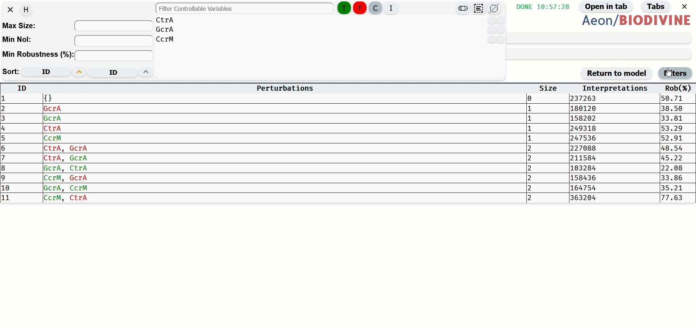
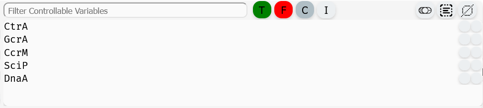
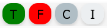
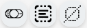
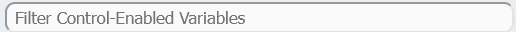

# Perturbation Table

*Perturbation Table*

The Perturbation Table provides a structured visualization of the perturbations computed during the control process. Each row in the table represents a single perturbation along with relevant details.

## Format of Perturbations

By default, perturbations are displayed in a color-coded format, where variables included in the perturbation are highlighted based on their Boolean value:

- Green indicates the variable should be set to true.
- Red indicates the variable should be set to false.

*Perturbation Color Format*

Alternatively, Aeon offers a text format for representing perturbations. In this format, each perturbation is listed with variable names followed by the Boolean value they should be fixed to, separated by a colon (:).

*Perturbation Text Format*

You can toggle between these two formats for an individual perturbation by clicking on its visualization within the row. To switch the format for all perturbations at once, click on the Perturbation header of the table.

## Details about Perturbation

*Perturbations with details about them*

Each row in the table not only displays the perturbation itself but also provides additional relevant information:

- ID – A unique identifier for the perturbation.
- Size – The number of variables included in the perturbation.
- Interpretations – The number of Boolean network interpretations for which the perturbation is effective.
- Rob (%) – The robustness of the perturbation, expressed as a percentage. This indicates the proportion of network interpretations where the perturbation successfully achieves the desired control.

## Filters and Sorts

Filters and sorts for the Perturbation table are accesible by clicking on the Filters button. You can hide them again by clicking the button or by clicking the cross in the left corner of the filters module.

*How to navigate to the Filter Menu and demonstration of basic filtering*

### Max Size

Maximal size
Filters from the table perturbation which contain more than specified number of variables. Whole number from 0.

### Min NoI

Minimal Number of Interpretations. Filters from the table perturbation which work for less than specified number of interpretations of the model. Whole number from 0.

### Min Robustness (%)

Minimal Robustness. Filters from the table perturbations which work for less than specified % of models interpretations. a real number with two decimal places, ranging from 0 to 100.

### Filter by Fixed Variables

*Filter by Fixed Variables*

This filter allows specifying which variables should be included in the perturbation and with what Boolean values. To configure the filter:

- Select variables by clicking on them or using the Selection Buttons.
- Assign values using the Variable Perturbation Status Buttons.

#### Variable Perturbation Status Buttons

*Variable Perturbation Status Buttons*

These buttons define how selected variables should appear in the filtered perturbations:

- Green (T) – The variable must be true in the perturbation.
- Red (F) – The variable must be false in the perturbation.
- Gray (C) – The variable must be included in the perturbation, regardless of its value.
- Light Gray (I) – The variable is removed from the filter.

Clicking one of these buttons updates the filter status for all selected variables.

#### Selection buttons

*Button to toggle selected variables (left), select all variables (center), and deselect all variables (right)*

The Selection Buttons provide tools for efficiently selecting multiple variables in the Control-Enabled Editor. There are three buttons, each serving a different selection function:

- Toggle Selection (left, toggle switch icon) – Inverts the current selection: selected variables become unselected, and unselected variables become selected.
- Select All (center, square with lines icon) – Selects all variables in the editor.
- Deselect All (right, crossed-out square icon) – Clears the current selection, leaving no variables selected.

These buttons apply only to unfiltered variables. For example when a Variable Filter is applied, selecting all variables will select only those visible in the filtered list, leaving hidden variables unchanged. 

#### Variable Filter

*Input for the variable filter*

The Variable Filter is a text-based tool used to filter variables in the table of the Fixed Variables filter by name. The filter is case-sensitive and allows multiple variables to be filtered by separating their names with commas (,). It also supports partial matching, enabling searches for variables whose names start with a specific sequence of characters, even if incomplete.

#### Variable Table

The Variable Table within the filter module lists all Control-Enabled variables in the model. Variables can be selected by clicking on their row or multi-selected by dragging the left mouse button over them. Selected variables are highlighted in blue.

Each row in the table contains the variable name and two indicator circles:

- Filter Status Indicator (right circle) – Shows how the variable is included in the filter:
    - Green – Variable is in the filter as true.
    - Red – Variable is in the filter as false.
    - Gray – Variable must be included in the perturbation, regardless of value.
    - Light Gray – Variable is not included in the filter.

- Add to Filter Button (left circle) – Adds the variable's name to the Variable Filter input field.

### Sorting Options

Sorting in the Perturbation Table is controlled using two sorting widgets: Primary Sort (left) and Secondary Sort (right).

Each sorting widget consists of:

- A sorting parameter button that determines the sorting criterion:
    - ID – Sort by perturbation ID.
    - Size – Sort by the number of variables in the perturbation.
    - NoI (Number of Interpretations) – Sort by the number of model interpretations for which the perturbation is valid (equivalent to sorting by robustness).

- A sorting order button that sets the sorting direction:
    - Upward Arrow – Ascending order.
    - Downward Arrow – Descending order.

Sorting Behavior:

- Primary Sort determines the main sorting order.
- Secondary Sort applies when multiple perturbations share the same value in the Primary Sort criterion.
- If the same parameter is selected for both sorts, the Secondary Sort has no effect.
- If the Primary Sort is set to "ID", the Secondary Sort is ignored, as IDs are always unique.