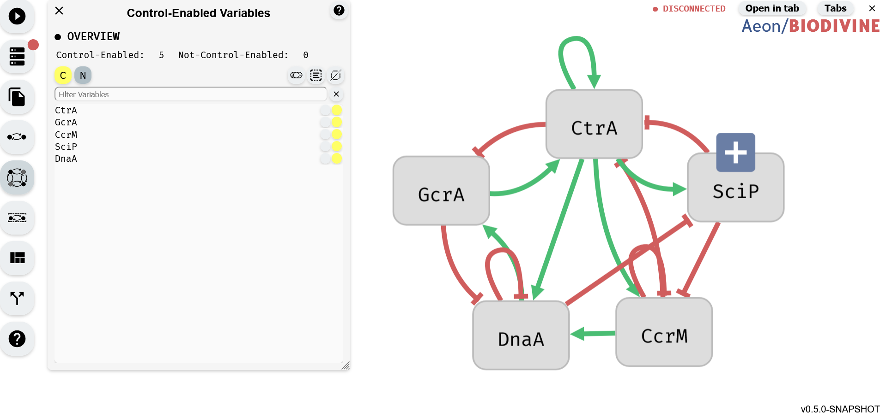
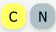

# Control-Enabled Editor

Aeon provides a dedicated editor for managing the Control-Enabled status of variables. This editor can be accessed by clicking the corresponding button in the left panel.

The primary purpose of the Control-Enabled Editor is to allow users to modify the Control-Enabled status of multiple variables simultaneously. Users can select variables from the table in the bottom section of the editor and toggle their Control-Enabled status. Only variables marked as Control-Enabled can be used in perturbations during the control computation process.

*Control-Enabled Editor module (left) with regulatory graph editor (right)*

## Control-Enabled status Buttons

*Buttons for setting selected variables to Control-Enabled (left) and button for setting variables to Not-Control-Enabled (right)*

Aeon provides two buttons for adjusting the Control-Enabled status of variables. Each button corresponds to a specific Control-Enabled status:

- The yellow button sets selected variables to Control-Enabled.
- The gray button sets selected variables to Not-Control-Enabled.

Clicking one of these buttons updates the Control-Enabled status of all variables currently selected in the Variable Editor.

## Selection buttons

*Button to toggle selected variables (left), select all variables (center), and deselect all variables (right)*

The Selection Buttons provide tools for efficiently selecting multiple variables in the Control-Enabled Editor. There are three buttons, each serving a different selection function:

- Toggle Selection (left, toggle switch icon) – Inverts the current selection: selected variables become unselected, and unselected variables become selected.
- Select All (center, square with lines icon) – Selects all variables in the editor.
- Deselect All (right, crossed-out square icon) – Clears the current selection, leaving no variables selected.

These buttons apply only to unfiltered variables. For example when a Variable Filter is applied, selecting all variables will select only those visible in the filtered list, leaving hidden variables unchanged. 

## Variable Filter

*Input for the varialbe filter*

The Variable Filter is a text-based tool used to filter variables in the Control-Enabled Editor by name. The filter is case-sensitive and allows multiple variables to be filtered by separating their names with commas (,). It also supports partial matching, enabling searches for variables whose names start with a specific sequence of characters, even if incomplete.

## Variable Table

The table at the bottom of the editor contains all the variables in the model. You can toggle the selection status of a variable by clicking on the corresponding row. To select or unselect multiple variables at once, hold down the left mouse button and drag over the variables. Selected variables are highlighted in blue.

Each row in the table displays the variable's name along with two circles:

- The circle on the right is the Control-Enabled status indicator. If it is yellow, the variable is Control-Enabled; if it is gray, the variable is Not-Control-Enabled.
- The circle on the left is the Add to Filter button, which adds the variable's name to the end of the Variable Filter.