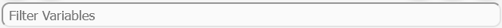

# Phenotype Editor

Aeon provides a dedicated editor for setting the phenotype of the control computation. This editor can be accessed by clicking the corresponding button in the left panel.

The primary purpose of the Phenotype Editor is to allow users to define the desired attractor of the network, specified as a set of variables with their desired Boolean values. Users can select variables from the table in the bottom section of the editor and assign them the appropriate values (true or false) to form the target phenotype. This phenotype will guide the control computation toward the desired attractor.

*Phenotype Editor module (left) with regulatory graph editor (right)*

## Phenotype Oscillation

*Phenotype Oscillation Button*

The Phenotype Oscillation button allows you to specify whether the perturbations should target an oscillating or non-oscillating phenotype. Phenotype oscillation occurs when the Boolean network alternates between being in the phenotype state and not being in it. If the phenotype is non-oscillating, the network will remain in the phenotype state indefinitely.

The button has three states:

- Allowed: Computes perturbations for both oscillating and non-oscillating phenotypes.
- Required: Computes perturbations only for oscillating phenotypes
- Forbidden: Computes perturbations only for non-oscillating phenotypes.

## Phenotype Buttons

*Buttons for adding selected into phenotype as true (left), as false (middle) and button for removing selected variables from the phenotype (right)*

Aeon provides three buttons for adjusting the phenotype of the model. Each button corresponds to a specific phenotype status:

- The green button adds the selected variables into the phenotype with a value of true.
- The red button adds the selected variables into the phenotype with a value of false.
- The gray button removes the selected variables from the phenotype.

## Selection buttons

*Button to toggle selected variables (left), select all variables (center), and deselect all variables (right)*

The Selection Buttons provide tools for efficiently selecting multiple variables in the Controllability Editor. There are three buttons, each serving a different selection function:

- Toggle Selection (left, toggle switch icon) – Inverts the current selection: selected variables become unselected, and unselected variables become selected.
- Select All (center, square with lines icon) – Selects all variables in the editor.
- Deselect All (right, crossed-out square icon) – Clears the current selection, leaving no variables selected.

These buttons apply only to unfiltered variables. For example when a Variable Filter is applied, selecting all variables will select only those visible in the filtered list, leaving hidden variables unchanged. 

## Variable Filter

*Input for the varialbe filter*

The Variable Filter is a text-based tool used to filter variables in the Controllability Editor by name. The filter is case-sensitive and allows multiple variables to be filtered by separating their names with commas (,). It also supports partial matching, enabling searches for variables whose names start with a specific sequence of characters, even if incomplete.

## Variable Table

The table at the bottom of the editor contains all the variables in the model. You can toggle the selection status of a variable by clicking on the corresponding row. To select or unselect multiple variables at once, hold down the left mouse button and drag over the variables. Selected variables are highlighted in blue.

Each row in the table displays the variable's name along with two circles:

- The circle on the right is the phenotype indicator. If it is green, the variable is in the phenotype as true; if it is red, the variable is in the phenotype as false; and if it is gray, the variable is not present in the phenotype.
- The circle on the left is the Add to Filter button, which adds the variable's name to the end of the Variable Filter.