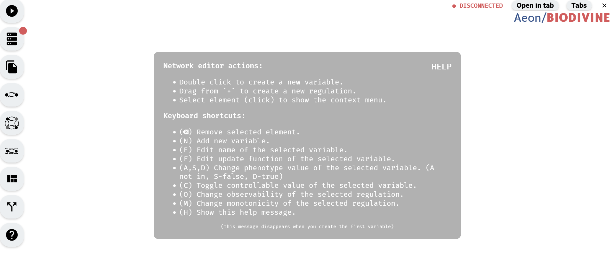

# Introduction

AEON is available as an online tool at [https://biodivine.fi.muni.cz/aeon/](https://biodivine.fi.muni.cz/aeon/). On this website, you can pick the version of AEON you want to use (naturally, we recommend the latest version), and you will be redirected to its online interface, which should look similar to this:

*AEON User interface.*

In the middle, there is a quick help message, which disappears when you load a Boolean network, but you can always bring it back by holding down **H**. On the left, there is a main menu which you can use to import existing networks, manage the details of your model, or start attractor analysis.

> If you for whatever reason cannot access this website, there is a mirror on [Github pages](https://sybila.github.io/aeon/), but the version there may not be always up to date. Alternatively, you can also run your own instance of AEON. It is a simple static HTML/JavaScript website, and the sources are available on [Github](https://github.com/sybila/biodivine-aeon-client). See the *Building AEON* chapter for more details.

Out of the box, AEON allows you to perform basic actions, like creating or editing a Boolean network. However, AEON uses a native *compute engine* which handles computationally intensive tasks efficiently outside your browser. Therefore, to do almost anything beside editing Boolean networks, you need a compute engine the website can connect to. In the next chapter, we discuss how to download and run this *compute engine*.

> At the moment, due to security reasons, some browsers are blocking non-HTTPS JavaScript connections to foreign websites if the page itself is using HTTPS. For this reason, you may not be able to connect to a local compute engine from Safari, Brave or other browser with this policy. If you can, please use Chrome for the rest of this tutorial.