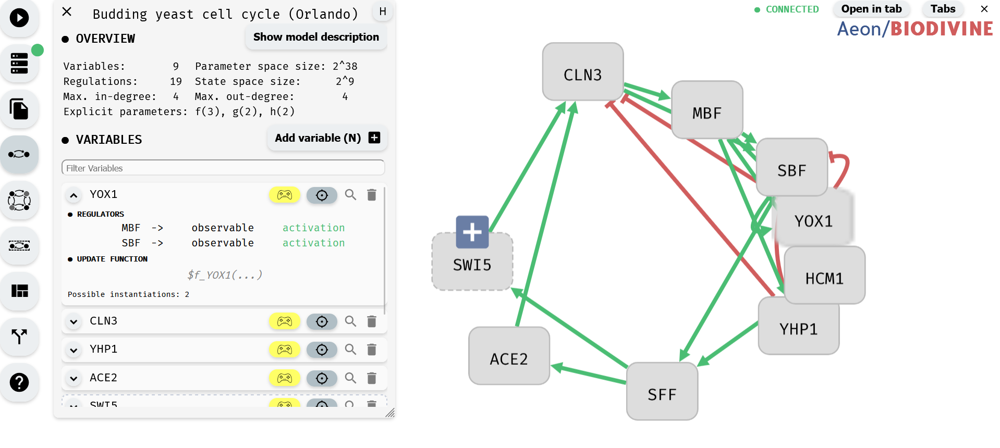

# Model Editor

This chapter explains how to create, import, modify, and export Boolean networks in Aeon, along with enhancing them with logical parameters. If you only need to work with existing Boolean networks (available in .sbml or .aeon formats) without editing, you can skip to the final section of this chapter.

Aeon's model editing functionality is divided into two main components:

- Regulatory Graph Editor – The main area of the Aeon window, used for interactive editing of network structure.
- Model Panel – A sidebar that provides tools for modifying update functions and adding logical parameters. It can be opened by clicking the Model Editor button in the left menu.

*Model panel (left) and regulatory graph editor (right)*

We first focus on the regulatory graph editor, and show how to manipulate network variables and regulations. Then, we shift our focus to the model panel and show how to edit network update functions or add parameters. Finally, we look at structural properties of regulatory graphs and how AEON verifies these properties on-the-fly. At the end of the chapter, we discuss model formats supported by AEON.

Note: This chapter does not cover setting control parameters with the Model Editor. For that, refer to the [Setting of Control Parameters with Model Editor chapter](../control_computation/setting_control_parameters/setting_with_model_editor.md)