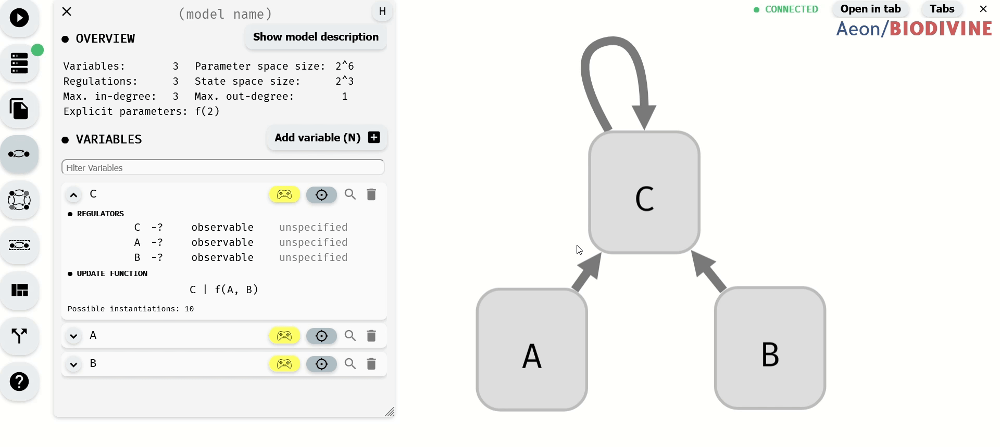
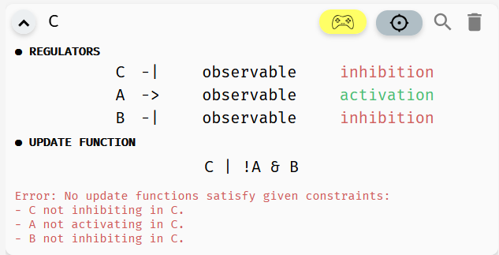
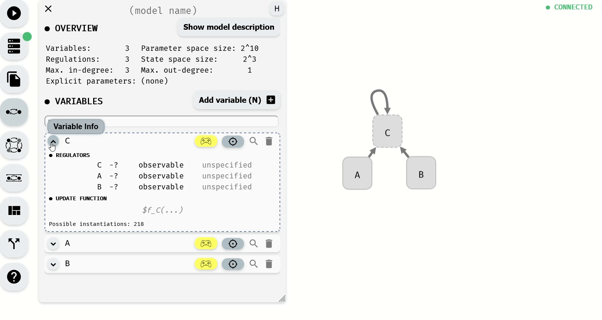

# Regulatory graph properties

In our regulatory graphs, to this point, we assumed each regulation should have some effect on the output of the update function. This is a fairly reasonable assumption (if the regulation has no effect, it has no reason to be in the graph). However, we often have some additional information about the nature of the regulation.

### Regulation monotonicity

Many biological processes are either positively or negatively monotonous. In such case, we can mark a regulation as *activation* (positive monotonicity), or *inhibition* (negative monotonicity). To do this, you can either use the corresponding button in the *regulation menu*, or toggle the regulation status in the model panel.

*Changing monotonicity of regulations.*

Notice that as we change the monotonicity of a regulation, the number of instantiations of the update function also changes. This is because the number of Boolean functions with that specific property is smaller. Specifically, if a regulation is positively monotonous, we expect that increasing the value of the regulator cannot decrease the value of the output, and vice versa, when the monotonicity is negative, increasing the value of the regulator cannot increase the function output.

Specifically, if we set the regulation `B -> C` as activation, we reduce the number of instantiations of `f(A, B)` to only four options: `A & B`, `!A & B`, `A | B`, `!A | B`. In particular, notice that in each such function, `B` appears in its positive form (without negation). We could further limit the number of instantiations by also setting a monotonicity for the `A -> C` relationship.

The regulation `C -> C` is slightly different. The dependence `C -> C` is already fully specified in the update function. Changing the properties of the regulation therefore cannot change the number of instantiations. However, it can make the function completely invalid if the properties given by the regulatory graph do not match the properties of the update function. Since in our case, `C` appears positively in `C | f(A, B)`, AEON reports an error when the regulation is marked as an inhibition, but is ok with either activation or unspecified monotonicity.

> When possible, AEON will try to infer which regulation properties cause the function to be invalid. You can then update the properties accordingly.

*AEON explains why a function is not consistent with its regulatory graph.*

### Observability

While it is often reasonable to expect each regulation to have some effect on the regulated variable, sometimes we may not be sure if a regulation is indeed (always) needed. In such case, we can mark the regulation as *non-observable*. 

AEON will then also consider instantiations where the argument does not have any impact on the resulting function value. To set this property, you can again use either the regulation menu, or the model panel:

*Changing observability of regulations.*

Notice that as we remove the observability requirements, the number of instantiations grows. In the end, the function has 15 possible instantiations. This includes all 16 possible binary Boolean functions except for one: `true`.

If we set `f(A, B) = true`, the update function would be `C | true`, which is equivalent to `true`. However, we still have `C -> C` marked as observable, and a constant function does not depend on `C`. Meanwhile, instantiation `f(A, B) = false` is fine, because `C | false` is equivalent to `C`, which clearly still depends on the value of `C`.

Also, note that a function can "appear" to depend on a value of some variable, while in fact it does not. Take a simple example of `(A & B) | A`. If `A=true`, this function is always `true`, if `A=false`, this function is always `false`, regardless of the value of `B`. AEON will also detect and report these types of problems.

### Inconsistencies in real world models

Note that in many cases, you can encounter real-world models where AEON identifies some structural inconsistencies as described in this section. In such case, you cannot directly analyse the original model. 

This does not necessarily mean the model is incorrect, but it can suggest some kind of human error (a missing negation, wrong parenthesis, etc.), or an inconsistency between experimental data and literature (regulatory graph is often constructed based on known assumptions about the system, prior to the actual Boolean functions). 

In such case, assuming you cannot consult the author(s) of the model about the inconsistency, we recommend simply updating the regulatory graph to make it consistent with the update functions in the model. That is, removing the monotonicity or observability requirement from the problematic regulation.  