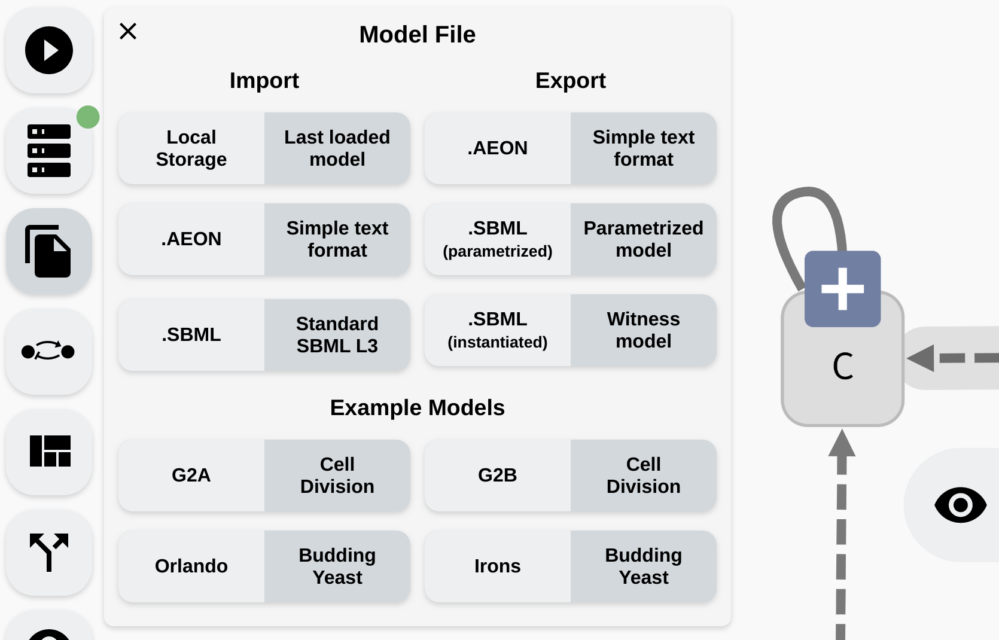

# Import/Export

Finally, lets discuss how to transfer your models into AEON, as well as sharing them with the world afterwards. AEON has an `Import/Export` panel accessible in the left menu:


*Import/Export panel in AEON.*

At the bottom, you can see a collection of four pre-defined example models which you can open to demo AEONs functionality. Each model contains additional description of its properties.

> The `Local Storage` option tries to continuously save the model you are working on into the local storage of your browser. If you accidentally reload your editor and lose some unfinished work, you can try to recover it from this local storage.

### SBML-qual

AEON should be fully compatible with [SBML-qual](http://sbml.org/Documents/Specifications/SBML_Level_3/Packages/Qualitative_Models_%28qual%29) models. You can therefore both import and export `.sbml` models from AEON. However, there are a few restrictions to keep in mind:

 - AEON only supports alphanumeric names with underscores, while SBML also supports other special characters (for example`[]`). During import, AEON will replace all conflicting characters with underscores. If this leads to a name clash, it also adds a unique ID to the name of each variable. 
 - AEON will try to import layout information from the SBML file, but the layout may be incompatible (some tools use a `[0,1]` coordinate system, which makes the layout very small), or completely missing. In such case, all variable nodes will appear at the same position. You can then apply the automatic layout to better visualise the network.
 - SBML does not have explicit support for observability. If a regulator appears in an update function, AEON will import this regulation as observable. If the regulator is completely missing in the function, it will be imported as non-observable.
 - SBML may contain variables with unspecified update functions. These are naturally imported as implicitly parametrised. However, there is no support for explicit parameters. To implement this functionality, if a model contains explicit parameters, we export the update function with a `<csymbol>` MathML element (used to denote arbitrary function invocation). This can be imported back into AEON, but won't be interpretable in other tools that follow the SBML standard. You can disable this behaviour by using the `SBML (instantiated)` button. In this mode, AEON will pick some arbitrary instantiation for each parameter and thus export a valid SBML.

### Aeon format

Since SBML is quite hard to edit by hand, as well as parse correctly, we also provide a simplified text based format. In this format, the regulatory graph is described as a list of edges, where each edge is encoded as `regulator [->,-|,-?,->?,-|?,-??] target`. Here, `regulator` and `target` are the names of the network variables, and the arrow connecting them describes the type of regulation. Then `->` denotes activation, `-|` inhibition and `-?` is unspecified monotonicity. Finally, an extra `?` signifies that the regulation is non-observable.

An update function for variable `X` is written as `$A: function`, where the format of the actual  functions in `.aeon` files is the same as in the edit fields in the AEON interface. Additional information (model name, description and layout) is encoded in comments (lines starting with `#`). The order of declarations is not taken into account. Example of `.aeon` model:

```
    #name:Asymmetric Cell Division A
    #description:Lorem Ipsum....
    #position:CtrA:419,94
    CtrA -> CtrA
    GcrA -> CtrA
    CcrM -| CtrA
    SciP -| CtrA
    $CtrA: CtrA & GcrA & !CcrM & !SciP
    #position:GcrA:325,135
    CtrA -| GcrA
    DnaA -> GcrA
    $GcrA: !CtrA | DnaA
    #position:CcrM:462,222
    CtrA -> CcrM
    CcrM -| CcrM
    SciP -| CcrM
    $CcrM: CtrA | f(CcrM, SciP)
    #position:SciP:506,133
    CtrA -> SciP
    DnaA -| SciP
    #position:DnaA:374,224
    CtrA -> DnaA
    GcrA -| DnaA
    DnaA -| DnaA
    CcrM -> DnaA
    $DnaA: g(CtrA, GcrA, DnaA) & CcrM
```

> Note that due to this encoding, `.aeon` technically can't represent a variable with no incoming or outgoing regulations. Such variable may be lost during export.