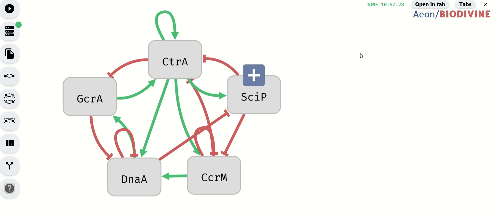
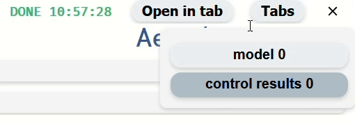

# Tab System

Aeon includes a tab system for managing multiple result visualizations efficiently. Each newly opened visualization appears as an inner tab, accessible through the Tab Menu. This system allows users to keep multiple visualizations open while working on the same model.

## Tab Menu

The Tab Menu contains all opened visualizations related to the current model.

- Opening the Tab Menu – Click the Tabs button in the upper right corner of the tool.
- Hiding the Tab Menu – Click the Tabs button again to close it.

*Demonstration of the Inner Tab Menu*

## Opening Inner Tabs in a New Browser Tab

To open an inner tab in a separate browser tab, click the Open in Tab button, located to the left of the Tabs button.

*Opening inner tab with Perturbation Table in a new browser tab*

## Closing Inner Tabs

You can close an inner tab by clicking the X button in the upper right corner of the tab.

- This option is available only when more than one inner tab is open.

*Closing inner tab*

## Returning to the Model Tab

Certain visualizations include a Return to Model button.

Clicking this button switches to the model's inner tab.
If the model's inner tab was previously closed, a new inner tab with the model will be opened.